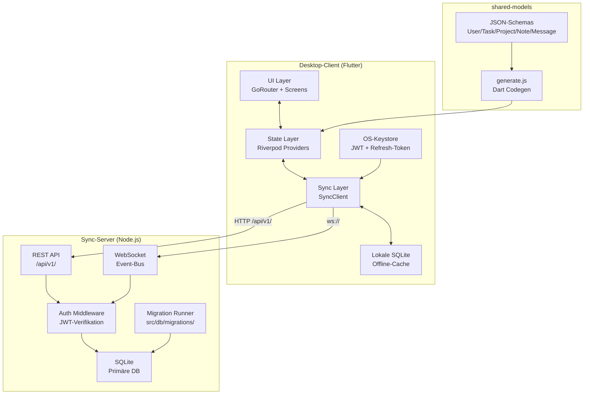

# TeamLink

[](https://devconnectplatform.com/u/vyren)

Kollaborations-Desktop-App für kleine Teams — Aufgaben, geteilte Notizen und 1:1-Chat ohne externe Dienste. Läuft vollständig auf eigener Infrastruktur (on-premise).

---

## Features

| Feature | Details |
|---|---|
| Aufgaben | Titel, Deadline, Zuweisung — in unter 10 Sek. anlegen |
| Aufgaben übernehmen | Offene Aufgaben per einzigem Klick einem selbst zuweisen |
| Geteilte Notizen | Echtzeit-Sync zwischen allen Projektmitgliedern (< 200 ms im LAN) |
| 1:1-Chat | Direktnachrichten ohne externen Dienst, über eigenen Sync-Server |
| Dashboard | Offene / übernommene / erledigte Aufgaben + Deadlines der nächsten 14 Tage |
| Rollen | Lead, Mitglied, Beobachter als Labels |
| Offline-Modus | Vollständig offline nutzbar, automatische Sync-Wiederaufnahme ≤ 5 s |
| Mehrbenutzer-Editing | Konfliktfreies LWW (Last-Write-Wins) mit Timestamp-Vergleich + Audit-Log |

---

## Inhaltsverzeichnis

1. [Architektur](#architektur)
2. [Voraussetzungen](#voraussetzungen)
3. [Setup (Entwicklung)](#setup-entwicklung)
4. [Konfiguration](#konfiguration)
5. [Shared Models & Codegenerierung](#shared-models--codegenerierung)
6. [Tests & Qualitätssicherung](#tests--qualitätssicherung)
7. [Deployment-Guide](#deployment-guide)
8. [CI/CD-Pipeline](#cicd-pipeline)
9. [Monorepo-Struktur](#monorepo-struktur)

---

## Architektur

### Komponentenübersicht



### Datenpfad — Aufgabe anlegen

```
Flutter UI
  → Riverpod Provider (optimistisches Update + lokale SQLite)
  → HTTP POST /api/v1/projects/:id/tasks  (JWT im Authorization-Header)
  → Express Route → Auth-Middleware → SQLite INSERT + LWW-Timestamp
  → WebSocket broadcast „task:created" an alle verbundenen Clients
  → Riverpod Provider update → UI rebuild aller Clients (< 200 ms LAN)
```

### Authentifizierungs-Flow

```
Client                          Server
  │── POST /api/v1/auth/login ──► Passwort bcrypt-verify
  │◄─── { accessToken, refreshToken } ──
  │   (accessToken speichern: OS-Keystore)
  │   (refreshToken speichern: OS-Keystore)
  │
  │── API-Request (Bearer accessToken) ──► JWT-Verifikation
  │                                         Token abgelaufen?
  │── POST /api/v1/auth/refresh ──────────► refreshToken prüfen
  │◄──── { accessToken (neu) } ────────────
```

### Offline-Sync

Bei Netzwerkverlust speichert der SyncClient alle Mutationen in der lokalen SQLite-Queue. Sobald die Verbindung wiederhergestellt ist (Polling-Intervall 2 s, Reconnect ≤ 5 s), werden die Queue-Einträge sequenziell mit dem Server abgeglichen. Konflikte werden per LWW aufgelöst (`updated_at`-Timestamp).

---

## Voraussetzungen

| Tool | Mindestversion | Verwendung |
|---|---|---|
| Node.js | 18 LTS | Sync-Server |
| pnpm | 8 | JS-Monorepo-Management |
| Flutter SDK | 3.19 | Desktop-Client |
| Dart SDK | 3.3 (inkl. Flutter) | Codegen (build_runner) |
| melos | 3 | Dart-Monorepo-Skripte |

**Plattform-spezifisch (Build):**

| Plattform | Zusatz |
|---|---|
| Windows | Visual Studio 2022 (Desktop-Workload) |
| macOS | Xcode 15+, Rosetta (für x86_64) |
| Linux | `clang cmake ninja-build libgtk-3-dev` |

---

## Setup (Entwicklung)

### 1 — Repository klonen und Abhängigkeiten installieren

```bash
git clone <repo-url> TeamTool
cd TeamTool

# JS-Workspaces (sync-server + shared-models)
pnpm install

# Dart-Pakete
dart pub global activate melos
melos bootstrap
```

### 2 — Shared Models generieren

```bash
cd shared-models
node generate.js
# Dart-Modelle landen in: desktop-client/lib/models/
```

### 3 — Sync-Server starten

```bash
cd sync-server
cp .env.example .env    # Werte prüfen (PORT, DB_PATH, JWT_SECRET, ...)
npm run dev             # Auto-Reload via --watch
```

Server läuft auf `http://localhost:3000` · WebSocket: `ws://localhost:3000`

### 4 — Flutter-Client starten

```bash
cd desktop-client
dart run build_runner build --delete-conflicting-outputs  # Codegen (Freezed/Riverpod)
flutter run -d windows   # oder: -d macos / -d linux
```

Beim ersten Start verbindet sich die App automatisch mit `localhost:3000`.

---

## Konfiguration

### sync-server/.env

```dotenv
PORT=3000
DB_PATH=data/teamlink.db
NODE_ENV=development           # production | development
JWT_SECRET=change_me_in_prod   # min. 32 Zeichen, zufällig
JWT_EXPIRES_IN=15m
REFRESH_TOKEN_EXPIRES_IN=7d
BCRYPT_ROUNDS=12
RATE_LIMIT_WINDOW_MS=900000    # 15 min
RATE_LIMIT_MAX=100
```

### desktop-client — Server-URL

In `desktop-client/lib/services/server_config.dart` (oder via `--dart-define`):

```bash
flutter run --dart-define=SERVER_URL=http://192.168.1.10:3000
```

---

## Shared Models & Codegenerierung

JSON-Schemas sind die **einzige Quelle der Wahrheit** für alle Datenmodelle.

```
shared-models/
└── schemas/
    ├── user.json
    ├── task.json
    ├── project.json
    ├── note.json
    ├── message.json
    └── membership.json
```

Nach Schema-Änderungen:

```bash
node shared-models/generate.js
# → desktop-client/lib/models/*.dart  (Freezed + JsonSerializable)
```

Danach Dart-Codegen ausführen:

```bash
cd desktop-client
dart run build_runner build --delete-conflicting-outputs
```

---

## Tests & Qualitätssicherung

### Server-Tests

```bash
cd sync-server
npm test          # Jest — alle Unit- + Integrations-Tests
npm run lint      # ESLint + Prettier-Check
```

Ziel-Abdeckung: **70 %** kritische Pfade.

### Flutter-Analyse & Tests

```bash
# Analyse
melos run analyze          # flutter analyze alle Pakete
cd desktop-client && flutter analyze

# Tests
melos run test             # flutter test alle Pakete
cd desktop-client && flutter test --coverage

# Format-Check
melos run format           # dart format --set-exit-if-changed
```

Ziel-Abdeckung: **60 %** kritische Pfade.

### Monorepo-Aggregat

```bash
pnpm run server:test       # Server-Tests
pnpm run models:generate   # Codegen
melos run analyze          # Dart-Analyse
melos run build:windows    # Windows-Release-Build
```

---

## Deployment-Guide

### Produktions-Deployment (Linux-Server)

#### Systemvoraussetzungen

- Ubuntu 22.04 LTS (oder kompatibel)
- Node.js 18 LTS
- 1 GB RAM, 10 GB Disk (für DB + Logs)
- Ports: `3000` (intern) oder `443` (Reverse-Proxy)

#### 1 — Server-Dateien übertragen

```bash
rsync -az --exclude=node_modules --exclude=.git \
  sync-server/ user@server:/opt/teamlink/
```

#### 2 — Abhängigkeiten installieren & .env setzen

```bash
ssh user@server
cd /opt/teamlink
npm ci --omit=dev

cat > .env << 'EOF'
PORT=3000
DB_PATH=/var/lib/teamlink/teamlink.db
NODE_ENV=production
JWT_SECRET=<32+-zeichen-zufallsstring>
JWT_EXPIRES_IN=15m
REFRESH_TOKEN_EXPIRES_IN=7d
EOF

mkdir -p /var/lib/teamlink
```

#### 3 — Datenbankmigrationen ausführen

```bash
node src/db/migrate.js
```

Migrationen sind idempotent — bei jedem Server-Start automatisch ausgeführt.

#### 4 — Prozess-Manager (pm2)

```bash
npm install -g pm2
pm2 start src/index.js --name teamlink-server
pm2 save
pm2 startup    # Autostart nach Reboot einrichten
```

Alternativ als systemd-Service:

```ini
# /etc/systemd/system/teamlink.service
[Unit]
Description=TeamLink Sync Server
After=network.target

[Service]
Type=simple
User=teamlink
WorkingDirectory=/opt/teamlink
ExecStart=/usr/bin/node src/index.js
Restart=always
RestartSec=5
EnvironmentFile=/opt/teamlink/.env

[Install]
WantedBy=multi-user.target
```

```bash
systemctl daemon-reload
systemctl enable --now teamlink
```

#### 5 — Nginx als Reverse-Proxy (empfohlen)

```nginx
server {
    listen 443 ssl;
    server_name teamlink.example.com;

    ssl_certificate     /etc/ssl/teamlink/cert.pem;
    ssl_certificate_key /etc/ssl/teamlink/key.pem;

    location / {
        proxy_pass http://127.0.0.1:3000;
        proxy_http_version 1.1;
        # WebSocket-Upgrade
        proxy_set_header Upgrade $http_upgrade;
        proxy_set_header Connection "upgrade";
        proxy_set_header Host $host;
        proxy_set_header X-Real-IP $remote_addr;
        proxy_read_timeout 86400;
    }
}
```

#### Desktop-Client konfigurieren

Installer (MSIX/DMG/AppImage) mit Server-URL kompilieren:

```bash
flutter build windows \
  --dart-define=SERVER_URL=https://teamlink.example.com \
  --build-name=1.2.0 \
  --build-number=42
```

---

### Docker (optional)

```dockerfile
# sync-server/Dockerfile
FROM node:18-alpine
WORKDIR /app
COPY package*.json ./
RUN npm ci --omit=dev
COPY src/ ./src/
EXPOSE 3000
CMD ["node", "src/index.js"]
```

```bash
docker build -t teamlink-server ./sync-server
docker run -d \
  -p 3000:3000 \
  -v teamlink-data:/var/lib/teamlink \
  --env-file sync-server/.env \
  teamlink-server
```

---

## CI/CD-Pipeline

Die Release-Pipeline in `.github/workflows/release.yml` wird durch einen semver-Tag ausgelöst.

### Release auslösen

```bash
git tag v1.2.0
git push origin v1.2.0
```

### Pipeline-Schritte

```
tag push
  └─► version (semver extrahieren + validieren)
        ├─► build-windows  → TeamLink-1.2.0-windows-x64.msix
        ├─► build-macos    → TeamLink-1.2.0-macos-universal.dmg
        └─► build-linux    → TeamLink-1.2.0-linux-x86_64.AppImage
              └─► release  → GitHub Release + alle Artifacts hochladen
```

### Benötigte GitHub Secrets

| Secret | Beschreibung | Pflicht |
|---|---|---|
| `WINDOWS_CERTIFICATE` | PFX-Zertifikat (Base64) für MSIX-Signierung | Nein (unsigned fallback) |
| `WINDOWS_CERTIFICATE_PASSWORD` | Passwort für PFX | Wenn Cert gesetzt |
| `APPLE_CERTIFICATE` | Apple Developer Cert (Base64, .p12) | Nein (unsigned fallback) |
| `APPLE_CERTIFICATE_PASSWORD` | Passwort für .p12 | Wenn Cert gesetzt |
| `APPLE_SIGNING_IDENTITY` | z. B. `Developer ID Application: Firma (TEAMID)` | Wenn Cert gesetzt |
| `KEYCHAIN_PASSWORD` | Temporäres Keychain-Passwort (beliebig) | Wenn Cert gesetzt |
| `APPLE_ID` | Apple-ID E-Mail für Notarisierung | Nein |
| `APPLE_TEAM_ID` | Apple-Team-ID (10 Zeichen) | Wenn Apple-ID gesetzt |
| `APPLE_APP_PASSWORD` | App-spezifisches Passwort für notarytool | Wenn Apple-ID gesetzt |
| `GPG_PRIVATE_KEY` | GPG-Privat-Schlüssel (ASCII-armored) für AppImage | Nein |
| `GPG_PASSPHRASE` | GPG-Schlüssel-Passphrase | Wenn GPG-Key gesetzt |

Secrets ohne `Pflicht=Ja` sind optional — ohne sie werden unsignierte Artefakte erstellt.

### Artifacts

| Plattform | Dateiname | Signierung |
|---|---|---|
| Windows 10/11 | `TeamLink-X.Y.Z-windows-x64.msix` | PFX-Codesign |
| macOS 12+ | `TeamLink-X.Y.Z-macos-universal.dmg` | Developer ID + Notarisierung |
| Linux x86_64 | `TeamLink-X.Y.Z-linux-x86_64.AppImage` | GPG-Detach-Signatur |

---

## Monorepo-Struktur

```
TeamTool/
├── .github/
│   └── workflows/
│       └── release.yml          Release-CI (MSIX · DMG · AppImage)
├── desktop-client/              Flutter Desktop (Windows/macOS/Linux)
│   ├── lib/
│   │   ├── main.dart            Einstiegspunkt
│   │   ├── app.dart             App-Root, GoRouter, Riverpod-Scope
│   │   ├── models/              Dart-Modelle (aus shared-models generiert)
│   │   ├── core/                Konstanten, Theme, Utilities
│   │   └── features/            Feature-Screens (dashboard, auth, tasks …)
│   └── pubspec.yaml
├── sync-server/                 Node.js + Express + SQLite + WebSocket
│   ├── src/
│   │   ├── index.js             Server-Start + Migration-Runner
│   │   ├── app.js               Express-App + Middleware
│   │   ├── db/schema.js         SQLite-Schema
│   │   ├── middleware/auth.js   JWT-Auth-Middleware
│   │   └── routes/              REST-Endpunkte (/api/v1/auth, /projects, /tasks …)
│   ├── tests/
│   └── package.json
├── shared-models/               Single Source of Truth für Datenmodelle
│   ├── schemas/                 JSON-Schemas: user, task, project, note, message, membership
│   └── generate.js              Dart Codegenerator
├── melos.yaml                   Dart-Monorepo-Konfiguration
├── pnpm-workspace.yaml          JS-Workspace-Konfiguration
└── package.json                 Monorepo-Root-Skripte
```

---

## Lizenz

Proprietär — alle Rechte vorbehalten.
